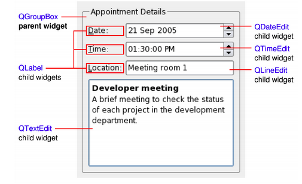
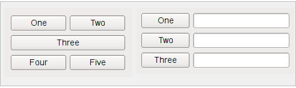
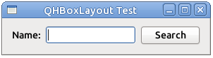
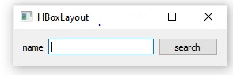
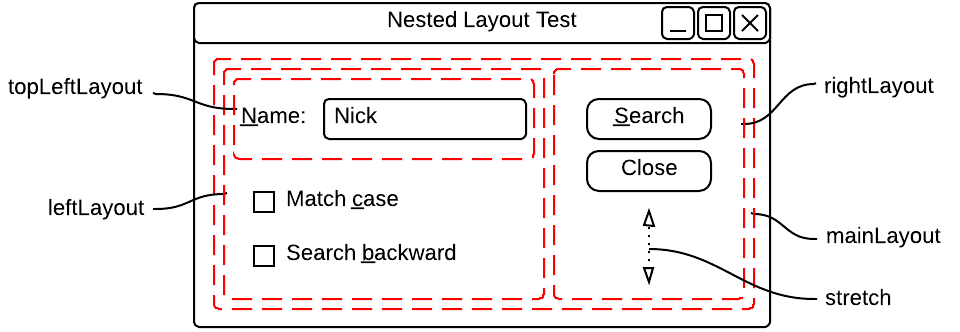
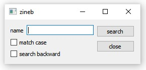
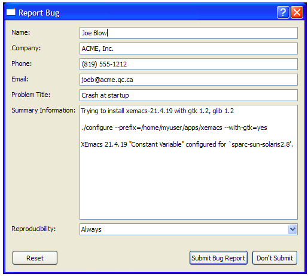
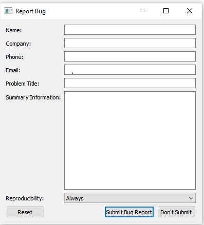
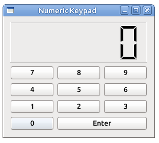
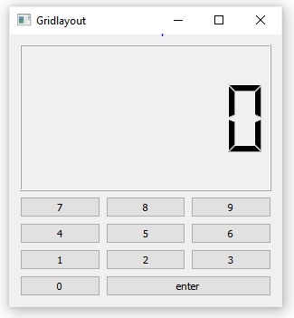

# Programming widgets and layouts

    
    The primary elements for designing user interfaces in Qt are Widgets and Layouts:

<br>

##     <span style="color:red">Widgets  </span>

 Widgets can display data and status information, receive user input, and provide a container for other widgets that should be grouped together. A widget that is not embedded in a parent widget is called a window.

<p align="center">
  
</p>


The <span style="color:blue">QWidget </span> class provides the basic capability to render to the screen, and to handle user input events. All UI elements that Qt provides are either subclasses of QWidget, or are used in connection with a QWidget subclass. Creating custom widgets is done by subclassing QWidget or a suitable subclass and reimplementing the virtual event handlers.

<br>

##      <span style="color:red">Layouts  </span>

Layouts are an elegant and flexible way to automatically arrange child widgets within their container. Each widget reports its size requirements to the layout through the sizeHintand sizePolicy properties, and the layout distributes the available space accordingly.

<p align="center">
  
</p>


<br>

# Objectif
 The goal of this practical course is combine basic C++ with some basic QT functionality to create a few Graphical User Interface(GUI) applications.


In this practical course we will work on four main projects which are: 

* <span style="color:green">Experimenting with QHBOXLayout  </span>
* <span style="color:green">Nested Layouts </span>
*  <span style="color:green">Bug report Form </span> 
* <span style="color:green">Grid Layout
 </span>
  


<br>


# Experimenting with QHBOXLayout
<br>


<span style="color:blue"> QBoxLayout </span>  takes the space it gets (from its parent layout or from the parentWidget()), divides it up into a row of boxes, and makes each managed widget fill one box.

<span style="color:blue"> QHBoxLayout </span> is a class  used to construct horizontal box layout objects.

First, we create the widgets we want to add to the layout. Then, we create the QHBoxLayout object, setting window as parent by passing it in the constructor; next we add the widgets to the layout. window will be the parent of the widgets that are added to the layout.

in order to practice this classes let's have some fun with the following example:

√ The goal is to display the following form :

<p align="center">
  
</p>


<br>

  first, we will create a project called <span style="color:blue"> HBOX1  </span>  and a class named <span style="color:blue"> Dialog1:  </span>

<br>

>The Header File (dialog1.h)

```java script
class Dialog1 :public QWidget
{
public:
    explicit Dialog1(QWidget *parent =nullptr);
protected:
    void createWidgets();
    void placeWidgets();
protected:
    QLabel *label;
    QLineEdit *edit;
    QPushButton *search;
    QHBoxLayout *layout;

};

```
<br>

>The Implementation File (dialog1.cpp)
```java script
//# include dialog1.h
```
```java script
Dialog1::Dialog1(QWidget *parent):QWidget(parent)
{
   createWidgets();
   placeWidgets();

}
void Dialog1 :: createWidgets()
{
    label =new QLabel("name");
    search =new QPushButton("search");
    edit =new QLineEdit;
    this->setWindowTitle("HBoxLayout");
};
void Dialog1 :: placeWidgets()
 { auto layout = new QHBoxLayout;

 //Sets the layout manager for this widget to layout. 

   this->setLayout(layout);
   layout->addWidget(label);
   layout->addWidget(edit);
   layout->addWidget(search);
 };
 ```
 <br>

>The main class
<br>


 In the main class we call the function show() to see the results :
 ```java script
 {
    QApplication a(argc, argv);

    auto D = new Dialog1();
    D->show();

    return a.exec();
}  
```
 <br>

 * ###     <span style="color:grey">Results  </span>
 
 <p align="center">
  
</p>
<br>

<br>

# Nested Layouts 
A <span style="color:blue">QCheckBox </span> is an option button that can be switched on (checked) or off (unchecked). Checkboxes are typically used to represent features in an application that can be enabled or disabled without affecting others. Different types of behavior can be implemented. 

in order to practice this class let's have some fun with the following form:

√ The goal is to display the following form :

<br>

<p align="center">
  
</p>
<br>


<br>


>The Header File (dialog2.h)
```java script
class Dialog2 :public QWidget
{
public:

    explicit Dialog2(QWidget *parent =nullptr);

protected:

    void createWidgets();
    void placeWidgets();
protected:
    QLabel *namelabel;
    QLineEdit *nameEdit;
    QPushButton *search;
    QCheckBox *match;
    QCheckBox *backward;
    QPushButton *close;

};
```

<br>

>The Implementation File (dialog2.cpp)
```java script
//# include dialog2.h
```
```java script
Dialog2::Dialog2(QWidget *parent) : QWidget(parent)
{

     createWidgets();
     placeWidgets();


}

void Dialog2::createWidgets(){
    search =new QPushButton("search");
    backward= new QCheckBox("search backward");
    match = new QCheckBox("match case");
    nameEdit =new QLineEdit();
    namelabel= new QLabel("name");
    close =new QPushButton("close");

}


void Dialog2::placeWidgets(){

    auto mainLayout=new QHBoxLayout;
    auto leftLayout =new QVBoxLayout;
    auto topLeftLayout=new QHBoxLayout;
    auto rightLayout= new QVBoxLayout;

    setLayout(mainLayout);
    //meta structuration
    mainLayout->addLayout(leftLayout);
    mainLayout->addLayout(rightLayout);
    //sub structuration
    leftLayout ->addLayout(topLeftLayout);
    //objects
    topLeftLayout->addWidget(namelabel);
    topLeftLayout->addWidget(nameEdit);
    leftLayout->addWidget(match);
    leftLayout->addWidget(backward);
            rightLayout->addWidget(search);
    rightLayout->addWidget(close);

    //Constructs a QSizePolicy object with Fixed as its horizontal and vertical policies 
    auto policy=new QSizePolicy(QSizePolicy::Fixed,QSizePolicy::Expanding);

    //Adds spacerItem to the end of this box layout 
    rightLayout ->addSpacerItem(new QSpacerItem(10,10,QSizePolicy::Expanding));


}  
```
<br>


>The main class
 ```java script
 {
    QApplication a(argc, argv);

    auto D = new Dialog2();
    D->show();

    return a.exec();
}  
```
<br>

* ###     <span style="color:grey">Results  </span>

<p align="center">
  
</p>

<br>

# Bug report Form
 The goal is to display the following form :

 <p align="center">
  
</p>

 <br>
 
 in this example we wille introduce two new differents classes:
 
 * An a <span style="color:blue">  QComboBox</span> provides a means of presenting a list of options to the user in a way that takes up the minimum amount of screen space.

 * An a <span style="color:blue">  QDialogButtonBox</span>  allows a developer to add buttons to it and will automatically use the appropriate layout for the user's desktop environment.

 <br>


 >The Header File (Form.h)
 ```java script
 class form : public QWidget{
    Q_OBJECT
  public:
//constructor
    form(QWidget *parent = nullptr);
    void createWidgets();
    void positionWidgets();

  private:

    QLineEdit* nameEdit ;
    QLineEdit* companyEdit ;
    QLineEdit* phoneEdit ;
    QLineEdit* emailEdit ;
    QLineEdit* problemEdit ;
    QTextEdit* summaryEdit ;

//create a QComboBox

    QComboBox* reproducibilityCombo;

//create a QDialogButtonBox

    QDialogButtonBox* buttonBox;
};
 ```

 >The Implementation File (form.cpp)

 ```java script
//# include form.h
```
 ```java script

form::form(QWidget* parent):QWidget(parent){

    createWidgets();
    positionWidgets();
    setWindowTitle(tr("Report Bug"));
  }
void form::createWidgets(){
    
    
    //creating the comboBox
    
        reproducibilityCombo = new QComboBox;
        reproducibilityCombo->addItem(tr("Always"));
        reproducibilityCombo->addItem(tr("Sometimes"));
        reproducibilityCombo->addItem(tr("Rarely"));
        
   //creating lineEdits

    nameEdit = new QLineEdit;
    companyEdit = new QLineEdit;
    phoneEdit = new QLineEdit;
    emailEdit = new QLineEdit;
    problemEdit = new QLineEdit;
    summaryEdit = new QTextEdit;

   //creating button box


    buttonBox = new QDialogButtonBox;
    buttonBox->addButton(tr("Submit Bug Report"),
                         QDialogButtonBox::AcceptRole);
    buttonBox->addButton(tr("Don't Submit"),
                         QDialogButtonBox::RejectRole);
    buttonBox->addButton(QDialogButtonBox::Reset);
}

void form::positionWidgets(){

//setting the form layout

    QFormLayout *layout = new QFormLayout;
            layout->addRow(tr("Name:"), nameEdit);
            layout->addRow(tr("Company:"), companyEdit);
            layout->addRow(tr("Phone:"), phoneEdit);
            layout->addRow(tr("Email:"), emailEdit);
            layout->addRow(tr("Problem Title:"), problemEdit);
            layout->addRow(tr("Summary Information:"),
                           summaryEdit);
            layout->addRow(tr("Reproducibility:"),
                           reproducibilityCombo);

//setting the main layout

            QVBoxLayout *mainLayout = new QVBoxLayout;
            mainLayout->addLayout(layout);
            mainLayout->addWidget(buttonBox);
            setLayout(mainLayout);
} 
```
<br>

>The main class

 ```java script
 {
    QApplication a(argc, argv);

    auto D = new form();
    D->show();

    return a.exec();
}  
```
<br>


* ###     <span style="color:grey">Results  </span>
 <p align="center">
  
</p>


<br>

# Grid Layout
For our final form, we will visit an imporant layout which is : <span style="color:blue"> the QGridLayout   </span>.

 * <span style="color:blue">QGridLayout   </span>takes the space made available to it (by its parent layout or by the parentWidget()), divides it up into rows and columns, and puts each widget it manages into the correct cell.

 in order to practice this class let's have some fun with the following example:


 √ The goal is to display the following form :
<br>

 <p align="center">
  
</p>

<br>


<br>


>The Header File (calculator.h)
```java script
class calculator : public QWidget
{
public:

    void createWidgets();
    void positionWidgets();

    //constructor
      calculator(QWidget *parent = nullptr);

private:

  QPushButton *buttons[10];
  QGridLayout *grid;

  //The QLCDNumber widget displays a number with LCD-like digits

  QLCDNumber *label;
  QPushButton *Enter;
  QVBoxLayout *mainLayout;

};
```
<br>


>The Implementation File (calculator.cpp)

```java script
//# include calculator.h
```

```java script
calculator::calculator(QWidget* parent):QWidget(parent)
{
createWidgets();
positionWidgets();
}


void calculator ::createWidgets(){

    for(int i=0;i<10;i++){
       QString str = QString::number(i);
        buttons[i]=new QPushButton(str);
    }

    Enter =new QPushButton("enter");
    label= new QLCDNumber();

}
void calculator :: positionWidgets(){
   mainLayout = new QVBoxLayout();
   grid = new QGridLayout();

   int j = 1;
   for(int i=2;i>=0;i--){
       for(int c=0;c<3;c++){
        grid->addWidget(buttons[j],i,c);
        j++;
        label->setMinimumHeight(80);

        //Sets the current number of digits to numDigits. Must be in the range 0..99.

        label->setDigitCount(6);
       }

   }
    grid->addWidget(buttons[0],3,0);
    grid->addWidget(Enter,3,1,1,2);
    mainLayout->addWidget(label);
    mainLayout->addLayout(grid);
    resize(300,300);
    setLayout(mainLayout);
} 
```
<br>


>The main class

 ```java script
 {
    QApplication a(argc, argv);

    auto C = new calculator();
    C->show();

    return a.exec();
}  
```
<br>

* ###    <span style="color:grey">Results  </span>
 <p align="center">
  
</p>

<br>


# Let's Recap! 

* To place widgets on a window, two options are available to us: position them to the nearest pixel (absolute) or position them flexibly in layouts (relative).
* Positioning in layouts is recommended: the widgets automatically occupy the available space according to the size of the window.
* There are several types of layouts depending on the organization you want to obtain from the widgets: QVBoxLayout (vertical), QHBoxLayout (horizontal), QGridLayout (in grid), QFormLayout (in form).
* It is possible to nest layouts between them: a layout can therefore contain another one. This allows us to achieve very precise positioning.


 > As we saw we can do interesting things with Widgets and Layouts
  .So 
See you in the next practical course with new things 😄 


  


